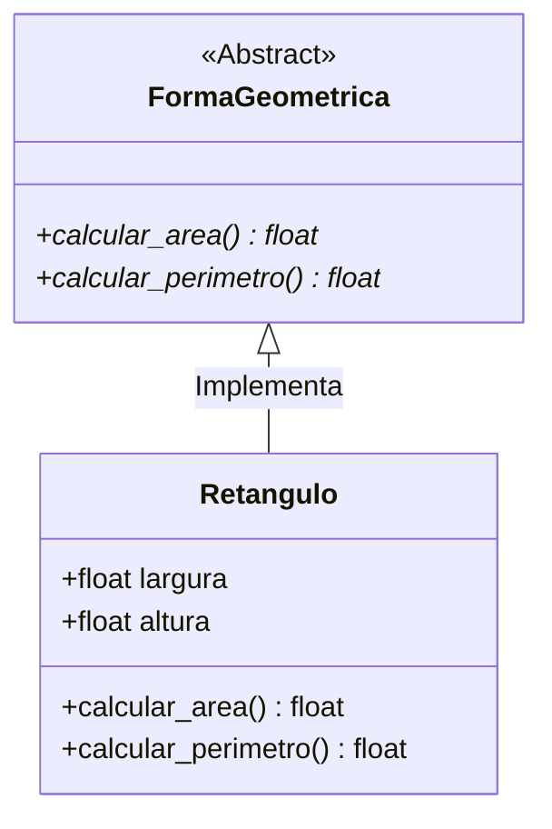

<div align="center">

</div>

### 🐍 Estudos de Programação Orientada a Objetos (POO) em Python

Este guia é um material de estudo focado na aplicação prática e teórica dos conceitos de **Programação Orientada a Objetos** em Python.

---

## 📑 Sumário de Conteúdos

1. [Como Instalar e Executar o Python](#-como-instalar-e-executar-o-python)
2. [Conceitos Fundamentais](#-conceitos-fundamentais)
3. [1. Classe Básica e Construtor (`__init__`)](#1-classe-básica-e-construtor-__init__)
4. [2. Métodos Mágicos / Dunder (`__str__`, `__len__`, `__eq__`)](#2-métodos-mágicos--dunder-methods)
5. [3. Herança e `super()`](#3-herança-e-super)
6. [4. Polimorfismo](#4-polimorfismo)
7. [5. Encapsulamento e Propriedades (`@property`)](#5-encapsulamento-e-propriedades)
8. [6. Métodos de Classe (`@classmethod`) e Estáticos (`@staticmethod`)](#6-métodos-de-classe-e-estáticos)
9. [7. Classes Abstratas (`abc`)](#7-classes-abstratas)
10. [ Resumo dos Recursos](#-resumo-dos-recursos)
11. [8. Diagramas UML Nativos (com Mermaid.js)](#8-diagramas)
12. [9. Tópicos Modernos de POO em Python](#9-tópicos-modernos-de-poo-em-python)

---

## 🛠️ Como Instalar e Executar o Python

Para executar os scripts deste repositório, é necessário ter o Python instalado no seu computador (versão 3.8 ou superior recomendada).

### Windows
1. Acesse o site oficial: [python.org/downloads](https://www.python.org/downloads/).
2. Faça o download do instalador da versão mais recente.
3. **Atenção:** Na primeira tela do instalador, marque obrigatoriamente a opção **"Add python.exe to PATH"** antes de clicar em **Install Now**.

### Linux (Ubuntu / Mint / Debian)
Abra o terminal e execute os comandos:
```bash
sudo apt update
sudo apt install python3 python3-pip

```
##  Como Executar os Scripts
No terminal, navegue até a pasta do repositório e execute o arquivo desejado:

```Bash
# No Windows
python arquivo.py

# No Linux ou macOS
python3 arquivo.py
```

## 📌 Conceitos Fundamentais

- **Classe:** É o "molde" ou blueprint que define a estrutura de dados e os comportamentos que um determinado conceito deve ter.
- **Objeto (Instância):** É um elemento real criado a partir da classe, contendo seus próprios valores para os atributos definidos.


## O Método __init__()
Todas as classes possuem uma função embutida chamada __init__(), que é executada automaticamente quando a classe é instanciada. Ela serve para inicializar os atributos do objeto.

## O Parâmetro self
O parâmetro self é uma referência à instância atual da classe. Ele é utilizado para acessar variáveis e métodos que pertencem àquela classe específica.

---

## 1. Classe Básica e Construtor (`__init__`)

O método `__init__()` é o construtor executado automaticamente ao instanciar um objeto. O parâmetro `self` representa a própria instância da classe.

```python
class Carro:
    # Construtor da classe
    def __init__(self, marca: str, modelo: str, ano: int):
        self.marca = marca      # Atributo de instância
        self.modelo = modelo    # Atributo de instância
        self.ano = ano          # Atributo de instância
        self.ligado = False     # Atributo com valor padrão

    # Método de instância
    def ligar(self):
        self.ligado = True
        print(f"O {self.modelo} está ligado.")

    def exibir_info(self):
        status = "Ligado" if self.ligado else "Desligado"
        print(f"{self.marca} {self.modelo} ({self.ano}) - Status: {status}")


# Instanciando objetos
meu_carro = Carro("Toyota", "Corolla", 2022)
meu_carro.exibir_info()  # Toyota Corolla (2022) - Status: Desligado
meu_carro.ligar()        # O Corolla está ligado.
```
---
## 2. Métodos Mágicos / Dunder Methods
Métodos que começam e terminam com dois sublinhados (__) alteram como objetos se comportam em operações nativas do Python (impressão, comparação, tamanho, etc.).

```Python
class Livro:
    def __init__(self, titulo: str, autor: str, paginas: int):
        self.titulo = titulo
        self.autor = autor
        self.paginas = paginas

    # Define o que é retornado quando usamos print(objeto) ou str(objeto)
    def __str__(self):
        return f"'{self.titulo}' por {self.autor}"

    # Define o retorno quando usamos len(objeto)
    def __len__(self):
        return self.paginas

    # Define o comportamento do operador de igualdade (==)
    def __eq__(self, outro_livro):
        if isinstance(outro_livro, Livro):
            return self.titulo == outro_livro.titulo and self.autor == outro_livro.autor
        return False


livro1 = Livro("Aventuras no Código", "Ana Silva", 320)
livro2 = Livro("Aventuras no Código", "Ana Silva", 320)

print(livro1)        # Imprime: 'Aventuras no Código' por Ana Silva
print(len(livro1))   # Imprime: 320
print(livro1 == livro2) # Imprime: True
```

---
## 3. Herança e super()
Herança permite que uma classe filha reutilize atributos e métodos de uma classe pai, evitando duplicação de código.

```Python
# Classe Pai (Superclasse)
class Funcionario:
    def __init__(self, nome: str, salario: float):
        self.nome = nome
        self.salario = salario

    def calcular_bonus(self):
        return self.salario * 0.10


# Classe Filha (Subclasse)
class Gerente(Funcionario):
    def __init__(self, nome: str, salario: float, departamento: str):
        # Chama o construtor da classe Pai
        super().__init__(nome, salario)
        self.departamento = departamento

    # Sobrescrita de método (Override)
    def calcular_bonus(self):
        return self.salario * 0.20


func = Funcionario("Carlos", 3000.0)
gerente = Gerente("Mariana", 8000.0, "TI")

print(f"Bônus {func.nome}: R$ {func.calcular_bonus():.2f}")     # R$ 300.00
print(f"Bônus {gerente.nome}: R$ {gerente.calcular_bonus():.2f}") # R$ 1600.00
```
---
## 4. Polimorfismo
Polimorfismo significa "muitas formas". Permite tratar objetos de classes diferentes usando a mesma interface ou nome de método.

```Python
class Cachorro:
    def emitir_som(self):
        return "Au Au!"

class Gato:
    def emitir_som(self):
        return "Miau!"

class Pato:
    def emitir_som(self):
        return "Quack!"


# Função polimórfica que aceita qualquer objeto com o método emitir_som()
def fazer_animal_falar(animal):
    print(animal.emitir_som())


animais = [Cachorro(), Gato(), Pato()]

for animal in animais:
    fazer_animal_falar(animal)

```   
--- 
## 5. Encapsulamento e Propriedades
Protege atributos contra alterações indevidas. Em Python:

_atributo (um underline) = Protegido (convenção para uso interno).

__atributo (dois underlines) = Privado (name mangling).

Usa-se o decorador @property para criar getters e setters de forma elegante.

```Python
class ContaBancaria:
    def __init__(self, titular: str, saldo_inicial: float = 0.0):
        self.titular = titular
        self.__saldo = saldo_inicial # Atributo privado

    # Getter para ler o saldo
    @property
    def saldo(self):
        return self.__saldo

    # Setter para alterar o saldo com validações
    @saldo.setter
    def saldo(self, valor: float):
        if valor < 0:
            print("Erro: O saldo não pode ser negativo!")
        else:
            self.__saldo = valor

    def depositar(self, valor: float):
        if valor > 0:
            self.__saldo += valor


conta = ContaBancaria("João", 1000.0)
print(f"Saldo atual: R$ {conta.saldo:.2f}")

conta.saldo = 1500.0   # Usa o setter
print(f"Novo saldo: R$ {conta.saldo:.2f}")

conta.saldo = -500.0   # Retorna mensagem de erro e bloqueia a alteração
```
---
## 6. Métodos de Classe e Estáticos
@classmethod: Recebe a classe (cls) como primeiro argumento. Ideal para métodos fabris (construtores alternativos).

@staticmethod: Não recebe self nem cls. Funciona como uma função comum agrupada dentro do contexto da classe.

```Python
class Data:
    def __init__(self, dia: int, mes: int, ano: int):
        self.dia = dia
        self.mes = mes
        self.ano = ano

    # Class Method: cria uma instância a partir de uma string "DD/MM/AAAA"
    @classmethod
    def de_string(cls, data_str: str):
        dia, mes, ano = map(int, data_str.split("/"))
        return cls(dia, mes, ano)

    # Static Method: função utilitária independente de instâncias
    @staticmethod
    def eh_ano_bissexto(ano: int) -> bool:
        return (ano % 4 == 0 and ano % 100 != 0) or (ano % 400 == 0)


# Usando o método de classe para criar o objeto
d1 = Data.de_string("25/12/2024")
print(f"Data criada: {d1.dia}/{d1.mes}/{d1.ano}")

# Usando o método estático
print("2024 é bissexto?", Data.eh_ano_bissexto(2024)) # True
```
---
## 7. Classes Abstratas
Classes abstratas não podem ser instanciadas diretamente e exigem que suas subclasses implementem os métodos decorados com @abstractmethod.

```Python
from abc import ABC, abstractmethod

class FormaGeometrica(ABC):

    @abstractmethod
    def calcular_area(self) -> float:
        pass

    @abstractmethod
    def calcular_perimetro(self) -> float:
        pass


class Retangulo(FormaGeometrica):
    def __init__(self, largura: float, altura: float):
        self.largura = largura
        self.altura = altura

    def calcular_area(self) -> float:
        return self.largura * self.altura

    def calcular_perimetro(self) -> float:
        return 2 * (self.largura + self.altura)


# forma = FormaGeometrica() # ERRO! Não é possível instanciar classes abstratas.
r = Retangulo(5.0, 3.0)
print(f"Área: {r.calcular_area()}")         # 15.0
print(f"Perímetro: {r.calcular_perimetro()}") # 16.0
```

---

## 📊 Resumo dos Recursos

| Conceito | Elemento / Decorador | Objetivo |
| :--- | :--- | :--- |
| **Construtor** | `def __init__(self)` | Inicializa os atributos do objeto |
| **Representação em Texto** | `def __str__(self)` | Define a exibição do objeto ao usar `print()` |
| **Herança** | `class Filha(Pai):` | Herda métodos e atributos de outra classe |
| **Encapsulamento** | `@property` / `@setter` | Protege variáveis e valida alterações de valor |
| **Método de Classe** | `@classmethod` | Manipula dados da classe / Construtores alternativos |
| **Método Estático** | `@staticmethod` | Funções utilitárias sem dependência de estado |
| **Classe Abstrata** | `ABC` / `@abstractmethod` | Garante uma estrutura obrigatória em subclasses |

---

## 8. Diagramas 


### Exemplo 1: Herança e Interface Abstrata

## Exemplo 2: Relação de Composição
```mermaid
classDiagram
    class Motor {
        +int cv
        +bool ligado
        +ligar() void
    }

    class Carro {
        +String marca
        +String modelo
        +Motor motor
        +ligar_carro() void
    }

    Carro *-- Motor : Composição (Tem-um)
 ```

---


## 9. Tópicos Modernos de POO em Python
## 9.1 Dataclasses (dataclasses)
Introduzidas no Python 3.7, as @dataclass eliminam o código repetitivo (boilerplate) necessário para criar classes focadas em armazenar dados, gerando automaticamente os métodos __init__(), __repr__(), __eq__() e outros.

```Python
from dataclasses import dataclass, field

@dataclass
class ItemPedido:
    nome: str
    preco: float
    quantidade: int = 1  # Valor padrão

    # Método para calcular o valor total do item
    def total(self) -> float:
        return self.preco * self.quantidade


item1 = ItemPedido("Teclado Mecânico", 250.0, 2)
item2 = ItemPedido("Mousepad", 50.0)

print(item1)          # Retorno automático formatado: ItemPedido(nome='Teclado Mecânico', preco=250.0, quantidade=2)
print(item1.total())  # 500.0
print(item1 == item2) # False (compara os valores dos atributos automaticamente)
```

## 9.2 Exceções Customizadas
Criar classes de exceções próprias herdando da classe base Exception é uma boa prática para domínios de negócios específicos, tornando a tratativa de erros mais clara e profissional.

```Python
# Classe de exceção personalizada
class SaldoInsuficienteError(Exception):
    """Exceção lançada quando uma operação excede o saldo disponível."""
    def __init__(self, saldo_atual: float, valor_saque: float):
        self.saldo_atual = saldo_atual
        self.valor_saque = valor_saque
        super().__init__(f"Tentativa de sacar R$ {valor_saque:.2f}, mas o saldo atual é de apenas R$ {saldo_atual:.2f}.")


class ContaCorrente:
    def __init__(self, saldo: float):
        self.saldo = saldo

    def sacar(self, valor: float):
        if valor > self.saldo:
            raise SaldoInsuficienteError(self.saldo, valor)
        self.saldo -= valor
        print(f"Saque de R$ {valor:.2f} realizado com sucesso!")


conta = ContaCorrente(100.0)

try:
    conta.sacar(250.0)
except SaldoInsuficienteError as e:
    print(f"Erro na Operação: {e}")
```
## 9.3 Composição vs. Herança
Um dos princípios do design de software orientado a objetos é "Preferir composição a herança".

Herança: Define uma relação de "É UM" (ex: Gerente é um Funcionario).

Composição: Define uma relação de "TEM UM" (ex: Carro tem um Motor).

A composição evita hierarquias de herança rígidas e difíceis de manter.

```Python
class Motor:
    def __init__(self, potencia_cv: int):
        self.potencia_cv = potencia_cv
        self.ligado = False

    def ligar(self):
        self.ligado = True

    def desligar(self):
        self.ligado = False


class Carro:
    def __init__(self, modelo: str, potencia_motor: int):
        self.modelo = modelo
        # Composição: O objeto Carro contém um objeto Motor
        self.motor = Motor(potencia_motor)

    def dar_partida(self):
        self.motor.ligar()
        print(f"O {self.modelo} ligou o motor de {self.motor.potencia_cv} CV!")


meu_carro = Carro("Golf GTI", 230)
meu_carro.dar_partida() # O Golf GTI ligou o motor de 230 CV!
```